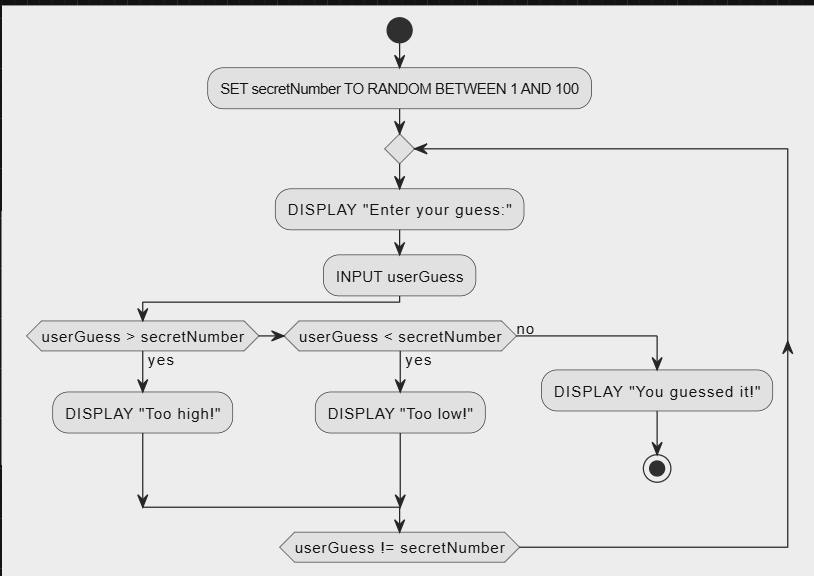

### **1. Algorithm (Thuật toán)**

- **Định nghĩa:** Một tập hợp các bước được thực hiện theo trình tự để giải quyết một vấn đề.
- **Ví dụ thực tế:** Làm cà phê trứng Việt Nam:
  1. Chuẩn bị nguyên liệu.
  2. Pha cà phê bằng phin.
  3. Đánh trứng và sữa đến khi sánh mịn.
  4. Kết hợp cà phê và hỗn hợp trứng.

**Áp dụng thuật toán:** Đảm bảo các bước được thực hiện đúng thứ tự để có kết quả mong muốn.

---

### **2. Algorithm Representation (Biểu diễn thuật toán)**

- **Cách biểu diễn:**
  - **Pseudo-code (Mã giả):** Mô tả logic bằng ngôn ngữ tự nhiên, dễ hiểu.
    - **Ví dụ:** Trò chơi đoán số:
      ```pseudo
      BEGIN
        SET secretNumber TO RANDOM BETWEEN 1 AND 100
        WHILE userGuess != secretNumber
          DISPLAY "Enter your guess:"
          INPUT userGuess
          IF userGuess > secretNumber THEN
            DISPLAY "Too high!"
          ELSE IF userGuess < secretNumber THEN
            DISPLAY "Too low!"
          ELSE
            DISPLAY "You guessed it!"
      END
      ```
  - **Flowchart (Lưu đồ):** Biểu diễn thuật toán bằng hình ảnh với các ký hiệu tiêu chuẩn.
    - **Hình ảnh minh họa:** 

**Lưu ý:** Lưu đồ thường dễ hiểu hơn mã giả đối với người mới bắt đầu.

---

### **3. Source Code Management (Quản lý mã nguồn)**

- **Version Control (Quản lý phiên bản):**
  - **SVN (Subversion):** Hệ thống quản lý phiên bản tập trung.
  - **Git:** Hệ thống quản lý phiên bản phân tán, phổ biến hiện nay.
    - **Ví dụ thực tế:** Lưu trữ mã nguồn trên GitHub để làm việc nhóm.

---

### **4. Environment Setup (Cài đặt môi trường lập trình)**

- **Các thành phần:**

  - **JVM (Java Virtual Machine):** Chạy mã bytecode trên mọi nền tảng.
  - **JDK (Java Development Kit):** Bộ công cụ phát triển Java, bao gồm cả JRE và các công cụ lập trình.
  - **JRE (Java Runtime Environment):** Môi trường chạy mã Java.

- **Cài đặt JDK:**
  - Tải JDK từ [Oracle](https://www.oracle.com/java/technologies/downloads/).
  - Chạy lệnh kiểm tra sau khi cài đặt:
    ```bash
    javac -version
    java -version
    ```

---

### **5. Launching the First Program (Chạy chương trình đầu tiên)**

- **Ví dụ:** Chương trình "Hello World":
  ```java
  public class HelloWorld {
      public static void main(String[] args) {
          System.out.println("Hello, world!");
      }
  }
  ```
  - **Bước thực hiện:**
    1. Viết mã trong IDE (Eclipse, IntelliJ) hoặc trình soạn thảo văn bản.
    2. Biên dịch bằng lệnh `javac HelloWorld.java`.
    3. Chạy chương trình bằng lệnh `java HelloWorld`.

---

### **6. Creating, Compiling, and Executing (Quy trình lập trình Java)**

- **Quy trình:**
  1. **Tạo mã:** Viết mã trong IDE hoặc trình soạn thảo.
  2. **Biên dịch:** Dịch mã nguồn thành bytecode bằng `javac`.
  3. **Chạy:** Thực thi bytecode trên JVM.

**Ví dụ thực tế:** In dòng chữ "Welcome to Java!".

```java
public class Welcome {
    public static void main(String[] args) {
        System.out.println("Welcome to Java!");
    }
}
```
